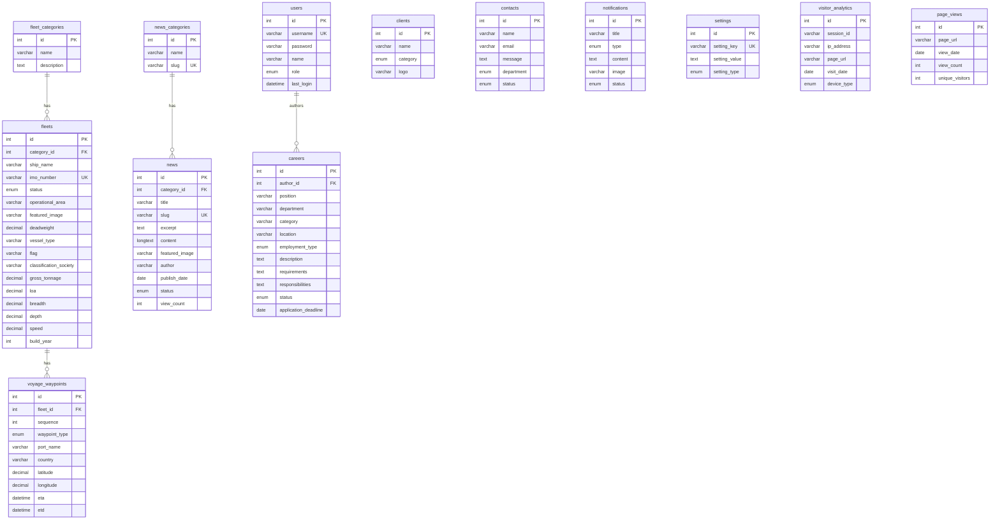

# Software Design Document (SDD)
## PT. Pelayaran Andalas Bahtera Baruna — Corporate Website

| Field | Value |
|---|---|
| **Project** | PT. ABB Corporate Website & Admin Portal |
| **Version** | 1.0.0 |
| **Date** | July 20, 2026 |
| **Author** | Development Team |
| **Status** | Active Development |

---

## Table of Contents

1. [Introduction](#1-introduction)
2. [System Overview](#2-system-overview)
3. [Architecture Design](#3-architecture-design)
4. [Technology Stack](#4-technology-stack)
5. [Directory Structure](#5-directory-structure)
6. [Database Design](#6-database-design)
7. [Module Specifications](#7-module-specifications)
8. [RAG AI Chatbot System](#8-rag-ai-chatbot-system)
9. [Admin Panel & RBAC](#9-admin-panel--rbac)
10. [API Endpoints](#10-api-endpoints)
11. [Security Considerations](#11-security-considerations)
12. [Frontend Architecture](#12-frontend-architecture)
13. [Third-Party Integrations](#13-third-party-integrations)
14. [Deployment & Environment](#14-deployment--environment)
15. [Future Improvements](#15-future-improvements)

---

## 1. Introduction

### 1.1 Purpose
This document provides a comprehensive technical description of the PT. ABB corporate website system. It covers the architecture, database schema, module design, API contracts, security model, and the RAG-powered AI chatbot subsystem.

### 1.2 Scope
The system encompasses:
- A public-facing corporate website with 10+ pages (Home, About, Services, Fleet, Clients, News, Careers, Contact).
- A secured admin portal with Role-Based Access Control (RBAC) for content management.
- A RAG (Retrieval-Augmented Generation) AI chatbot integrated via OpenRouter LLM APIs.
- Real-time fleet tracking via Leaflet.js interactive maps.
- A contact form with departmental routing.

### 1.3 Definitions & Acronyms

| Acronym | Definition |
|---|---|
| RAG | Retrieval-Augmented Generation |
| RBAC | Role-Based Access Control |
| LLM | Large Language Model |
| PDO | PHP Data Objects |
| IMO | International Maritime Organization |
| DWT | Deadweight Tonnage |
| CRUD | Create, Read, Update, Delete |

---

## 2. System Overview

```
┌─────────────────────────────────────────────────────────────┐
│                      CLIENT BROWSER                         │
│  ┌──────────┐  ┌──────────┐  ┌──────────┐  ┌────────────┐   │
│  │ Public   │  │ Admin    │  │ Chatbot  │  │ Fleet Map  │   │
│  │ Pages    │  │ Portal   │  │ Widget   │  │ (Leaflet)  │   │
│  └────┬─────┘  └────┬─────┘  └────┬─────┘  └─────┬──────┘   │
└───────┼──────────────┼─────────────┼──────────────┼─────────┘
        │              │             │              │
        ▼              ▼             ▼              ▼
┌─────────────────────────────────────────────────────────────┐
│                    PHP APPLICATION LAYER                    │
│  ┌──────────┐  ┌──────────┐  ┌──────────┐  ┌────────────┐   │
│  │ Pages    │  │ Admin    │  │ API      │  │ Includes   │   │
│  │ Module   │  │ Module   │  │ Module   │  │ (Shared)   │   │
│  └────┬─────┘  └────┬─────┘  └────┬─────┘  └─────┬──────┘   │
└───────┼──────────────┼─────────────┼──────────────┼─────────┘
        │              │             │              │
        ▼              ▼             ▼              ▼
┌─────────────────────────────────────────────────────────────┐
│              DATA & EXTERNAL SERVICES LAYER                 │
│  ┌────────────────┐  ┌─────────────┐  ┌──────────────────┐  │
│  │  PhpMyAdmin    │  │ OpenRouter  │  │ Google GeoChart  │  │
│  │  (PDO)         │  │ LLM API     │  │ Leaflet Tiles    │  │
│  └────────────────┘  └─────────────┘  └──────────────────┘  │
└─────────────────────────────────────────────────────────────┘
```

---

## 3. Architecture Design

### 3.1 Pattern
The application follows a **Page-Controller** architecture. Each PHP file in `pages/` and `admin/` acts as both controller and view, with shared logic extracted into `includes/`.

### 3.2 Request Lifecycle

```
HTTP Request
    │
    ▼
index.php / pages/*.php
    │
    ├── require includes/header.php  (session, nav, assets)
    ├── Database queries via PDO     (includes/config.php)
    ├── Render HTML with embedded PHP
    └── require includes/footer.php  (footer, chatbot widget, scripts)
```

### 3.3 Key Design Decisions

| Decision | Rationale |
|---|---|
| No PHP framework (vanilla PHP) | Lightweight deployment on shared hosting; minimal dependencies |
| PDO with prepared statements | SQL injection prevention across all queries |
| Inline CSS in footer for chatbot | Self-contained widget; no external CSS dependency |
| `.env` file for secrets | Separates credentials from source code |
| Triple-layer LLM fallback | Guarantees 100% chatbot uptime even during API outages |

---

## 4. Technology Stack

| Layer | Technology | Version |
|---|---|---|
| **Runtime** | PHP | 8.4.x |
| **Database** | MariaDB | 10.11.x |
| **Web Server** | Apache (Laragon) | 2.4.x |
| **Frontend** | HTML5, CSS3, Vanilla JS | — |
| **Maps** | Leaflet.js | 1.9.4 |
| **Charts** | Google Visualization GeoChart | current |
| **Fonts** | Google Fonts (Montserrat, Poppins, Oswald, Playfair Display) | — |
| **Icons** | Font Awesome | 6.4.0 |
| **LLM Gateway** | OpenRouter API | v1 |
| **Dev Environment** | Laragon (Windows) | — |

---

## 5. Directory Structure

```
pt-abb/
├── .env                          # API keys & model config
├── index.php                     # Homepage (entry point)
├── SOFTWARE_DESIGN_DOCUMENT.md   # This document
│
├── api/                          # REST API endpoints
│   ├── chat.php                  # RAG chatbot endpoint
│   ├── get_ship_details.php      # Ship specs JSON
│   └── get_voyage_waypoints.php  # Voyage route JSON
│
├── admin/                        # Admin portal (RBAC-protected)
│   ├── .htaccess                 # Directory protection
│   ├── login.php                 # Authentication
│   ├── logout.php                # Session destroy
│   ├── dashboard.php             # Main dashboard + popup manager
│   ├── manage-fleet.php          # Fleet CRUD
│   ├── manage-careers.php        # Careers CRUD
│   ├── manage-news.php           # News CRUD
│   ├── manage-clients.php        # Clients CRUD
│   ├── manage-users.php          # User management (super_admin only)
│   ├── manage-voyage-waypoints.php # Voyage data management
│   ├── manage-notifications.php  # Popup/notification manager
│   ├── upload-logo.php           # Logo upload utility
│   ├── upload-news-image.php     # CKEditor image upload
│   └── navbar.php                # Admin sidebar navigation
│
├── includes/                     # Shared components
│   ├── config.php                # Database class, helpers, session init
│   ├── header.php                # Universal HTML head, nav, path resolver
│   ├── footer.php                # Footer, chatbot widget, scripts
│   ├── api.php                   # Legacy API helpers
│   ├── functions.php             # Utility functions
│   ├── image-helper.php          # Image path resolution
│   ├── notification.php          # Popup notification renderer
│   └── process_contact.php       # Contact form handler
│
├── pages/                        # Public-facing pages
│   ├── about.php
│   ├── services.php              # Includes GeoChart operational map
│   ├── fleet.php                 # Fleet list + Leaflet maps
│   ├── ship-details.php          # Individual ship page
│   ├── clients.php               # Client logo grid
│   ├── news.php                  # News listing with category tabs
│   ├── news-detail.php           # Single news article
│   ├── careers.php               # Career landing page
│   ├── career-list.php           # Job listings
│   ├── career-detail.php         # Individual job posting
│   ├── contact.php               # Contact form
│   └── quick-view.php            # Fleet quick-view modal
│
└── assets/
    ├── css/
    │   ├── style.css             # Main stylesheet
    │   ├── fleet.css             # Fleet page styles
    │   ├── clients.css           # Client page styles
    │   └── admin-style.css       # Admin panel styles
    ├── images/                   # Ship photos, logos, news images
    │   ├── popups/               # Notification popup images
    │   └── news/                 # News article images
    └── logo/                     # Company & partner logos
```

---

## 6. Database Design

### 6.1 Entity-Relationship Diagram



### 6.2 Table Summary

| Table | Records | Purpose |
|---|---|---|
| `fleets` | 17 | Vessel registry with specs & operational area |
| `fleet_categories` | 4 | Vessel type classification |
| `voyage_waypoints` | 9 | GPS waypoints for vessel route mapping |
| `careers` | 8 | Job postings (corporate + crew) |
| `news` | 7 | Company news & press releases |
| `news_categories` | 3 | News classification |
| `clients` | 30 | Domestic & international client logos |
| `users` | 4 | Admin portal accounts |
| `contacts` | 0 | Contact form submissions |
| `notifications` | 3 | Popup/banner notifications |
| `settings` | 7 | Site-wide configuration |
| `contact_info` | 3 | Office contact details |
| `pages` | 0 | CMS pages (reserved) |
| `page_views` | 20+ | Page view counters |
| `visitor_analytics` | 16 | Visitor session tracking |

### 6.3 Key Constraints & Indexes

| Table | Constraint | Type |
|---|---|---|
| `fleets.imo_number` | Unique | Business key |
| `fleets.category_id → fleet_categories.id` | Foreign Key | ON DELETE SET NULL |
| `news.slug` | Unique | URL-safe identifier |
| `news.category_id → news_categories.id` | Foreign Key | ON DELETE SET NULL |
| `voyage_waypoints.fleet_id → fleets.id` | Foreign Key | ON DELETE CASCADE |
| `users.username` | Unique | Login identifier |
| `fleets.operational_area` | FULLTEXT | Search optimization |

---

## 7. Module Specifications

### 7.1 Public Pages Module (`pages/`)

| Page | Key Features |
|---|---|
| `index.php` | Hero section, company stats, fleet preview, news carousel, client logos |
| `about.php` | Company history, values, leadership, INSA membership |
| `services.php` | Charter types (Time/Freight), pneumatic system architecture, GeoChart coverage map |
| `fleet.php` | Searchable/filterable vessel grid, image modals, Leaflet voyage maps, global fleet position map |
| `clients.php` | Domestic/international tabbed logo grid |
| `news.php` | Category-tabbed news listing (Company News, Office Events, CSR) |
| `news-detail.php` | Full article view with view counter, YouTube embed support |
| `careers.php` | Career landing with pathway cards (Corporate/Crew) |
| `career-list.php` | Filtered job listings with category/department filters |
| `career-detail.php` | Full job description, requirements, responsibilities, apply CTA |
| `contact.php` | Multi-department contact form with validation |

### 7.2 Shared Includes Module (`includes/`)

#### `config.php` — Database & Helpers
```php
class Database {
    // PDO connection with utf8mb4 charset
    // ERRMODE_EXCEPTION for error handling
    // DEFAULT_FETCH_MODE = FETCH_ASSOC
}

function getCompanyName($type)   // Returns company name
function getLogoUrl()            // Returns logo path
function validateEmail($email)   // Filter validation
function formatNumber($number)   // Indonesian number formatting
```

#### `header.php` — Universal Header
- Detects current directory (`$in_pages_folder`) for relative path resolution
- Sets `$base_path`, `$assets_path`, `$pages_path` dynamically
- Renders favicon, CSS, Google Fonts, Font Awesome
- Active menu detection via `$current_page`
- Mobile hamburger menu with JavaScript toggle

#### `footer.php` — Universal Footer
- Company info, Quick Links, Head Office contact
- Social media links
- AI Chatbot widget (full HTML, CSS, and JS self-contained)
- Markdown parser for bot response formatting

### 7.3 Path Resolution Strategy

```
Location:       Root (index.php)    |  Subpage (pages/about.php)
─────────────────────────────────────────────────────────────
$base_path:     ''                  |  '../'
$assets_path:   'assets/'           |  '../assets/'
$pages_path:    'pages/'            |  ''
```

---

## 8. RAG AI Chatbot System

### 8.1 Architecture Overview

```
┌──────────┐     ┌──────────────┐     ┌─────────────┐     ┌──────────┐
│  User    │────▶│  Frontend    │────▶│  api/       │────▶│ MySQL    │
│  Query   │     │  (footer.php)│     │  chat.php   │     │ Database │
└──────────┘     └──────────────┘     └──────┬──────┘     └──────────┘
                                             │
                              ┌──────────────┼──────────────┐
                              ▼              ▼              ▼
                       ┌────────────┐ ┌────────────┐ ┌────────────┐
                       │  Primary   │ │  Fallback  │ │   Local    │
                       │  LLM Model │ │  LLM Model │ │  Rule-Base │
                       └────────────┘ └────────────┘ └────────────┘
```

### 8.2 Data Flow

1. **User Input** → Frontend `fetch()` POST to `api/chat.php`
2. **Context Assembly** → PHP queries ALL fleet, career, and news data from MySQL
3. **System Prompt Construction** → Company info + DB context + behavioral instructions
4. **LLM Invocation** → Primary model via OpenRouter API
5. **Fallback Chain** → If primary fails → secondary model → local rule-based engine
6. **Response Delivery** → JSON `{ reply: "..." }` → Frontend `parseMarkdown()` → DOM

### 8.3 Context Injection Strategy

The RAG system uses a **full-context injection** approach (not keyword-gated). On every request, the backend fetches:

| Data Source | SQL Query | Purpose |
|---|---|---|
| Company Info | Static string | General company facts |
| Fleet | `SELECT ship_name, imo_number, build_year, deadweight, operational_area, vessel_type, status FROM fleets` | All vessel data |
| Careers | `SELECT position, department, category, location, employment_type FROM careers WHERE status = 'open'` | Active job openings |
| News | `SELECT title, publish_date, excerpt FROM news WHERE status = 'published' ORDER BY publish_date DESC LIMIT 5` | Recent news |

### 8.4 LLM Configuration

| Parameter | Value |
|---|---|
| **API Gateway** | OpenRouter (`https://openrouter.ai/api/v1/chat/completions`) |
| **Primary Model** | `google/gemma-4-26b-a4b-it:free` |
| **Fallback Model** | `nvidia/nemotron-3-ultra-550b-a55b:free` |
| **Timeout** | 12 seconds |
| **Max Response** | 2-3 paragraphs (prompt-enforced) |
| **Language** | Auto-detect (English/Indonesian) |
| **Config Source** | `.env` file |

### 8.5 System Prompt Design

```
Role: Official AI Assistant of PT. ABB
Context: [Injected DB records]
Instructions:
  1. Professional, polite, helpful, concise
  2. Grounded strictly in provided context
  3. Match user's language (EN/ID)
  4. Max 2-3 paragraphs
```

### 8.6 Local Fallback Engine

When both LLM models fail, a deterministic rule-based system activates:

| Keyword Match | Response Topic |
|---|---|
| `fleet`, `vessel`, `ship` | Fleet overview |
| `charter` | Charter options + contact |
| `career`, `job`, `vacancy` | Open positions |
| `office`, `location`, `address`, `contact` | HQ address & phone |
| *(default)* | General greeting + email |

### 8.7 Frontend Markdown Parser

The `parseMarkdown()` function in `footer.php` handles:
- XSS prevention via HTML entity escaping
- `**bold**` → `<strong>bold</strong>`
- `*italic*` → `<em>italic</em>`
- `\n` → `<br>`

---

## 9. Admin Panel & RBAC

### 9.1 Authentication Flow

```
login.php
    │
    ├── POST username/password
    ├── PDO prepared statement: SELECT * FROM users WHERE username = :username
    ├── password_verify() against bcrypt hash
    ├── Set $_SESSION (admin_logged_in, admin_id, admin_username, admin_role, admin_name)
    ├── UPDATE users SET last_login = NOW()
    └── Redirect → dashboard.php
```

### 9.2 Role Permission Matrix

| Feature | `super_admin` | `hr_admin` | `crew_admin` | `pr_admin` |
|---|:---:|:---:|:---:|:---:|
| Dashboard Stats (Full) | ✅ | ❌ | ❌ | ❌ |
| Manage Fleet | ✅ | ❌ | ❌ | ❌ |
| Manage Clients | ✅ | ❌ | ❌ | ❌ |
| Manage Users | ✅ | ❌ | ❌ | ❌ |
| Manage News | ✅ | ❌ | ❌ | ✅ |
| Manage Careers | ✅ | ✅ | ✅ | ❌ |
| Popup/Notifications | ✅ | ✅ | ❌ | ❌ |
| Upload Logo | ✅ | ❌ | ❌ | ❌ |
| View Vacancies Count | ✅ | ✅ | ✅ | ✅ |

### 9.3 Session Guard Pattern

Every admin page begins with:
```php
if (session_status() === PHP_SESSION_NONE) { session_start(); }
if (!isset($_SESSION['admin_logged_in']) || $_SESSION['admin_logged_in'] !== true) {
    header('Location: login.php');
    exit;
}
$user_role = $_SESSION['admin_role'] ?? 'crew_admin'; // Least-privilege default
```

---

## 10. API Endpoints

### 10.1 `POST /api/chat.php` — RAG Chatbot

**Request:**
```json
{ "message": "Tell me about your fleet" }
```

**Response:**
```json
{ "reply": "PT. ABB operates a fleet of 17 specialized vessels..." }
```

**Error Handling:** Never returns an error to the client. Falls back through 3 layers.

### 10.2 `GET /api/get_ship_details.php?ship_id={id}` — Ship Specs

**Response:**
```json
{
  "id": 7, "ship_name": "MV. IRIANA", "imo_number": "9821158",
  "flag": "INDONESIA", "vessel_type": "PNEUMATIC & MANIFOLD",
  "deadweight": 10.68, "classification_society": "RINA",
  "gross_tonnage": 7.75, "build_year": 2015, ...
}
```

### 10.3 `GET /api/get_voyage_waypoints.php?ship_id={id}` — Voyage Route

**Response:**
```json
{
  "success": true,
  "waypoints": [
    {
      "sequence": 1, "waypoint_type": "departure",
      "port_name": "Port of Shanghai", "country": "China",
      "latitude": "31.23777800", "longitude": "121.47555600",
      "coordinates_valid": true, "eta_formatted": "Mar 14, 2024"
    }
  ]
}
```

---

## 11. Security Considerations

### 11.1 Implemented Measures

| Measure | Implementation | Status |
|---|---|---|
| SQL Injection Prevention | PDO prepared statements with named parameters on ALL queries | ✅ |
| Password Hashing | `password_hash()` / `password_verify()` with bcrypt (`$2y$10$`) | ✅ |
| XSS Prevention | `htmlspecialchars()` on all user-facing output; chatbot `parseMarkdown()` escapes HTML | ✅ |
| Session Security | `session_start()` with session guard on every admin page | ✅ |
| RBAC Enforcement | Backend role checks before executing privileged operations | ✅ |
| File Upload Validation | Extension whitelist (`jpg`, `jpeg`, `png`, `webp`), timestamped filenames | ✅ |
| API Key Separation | Stored in `.env`, loaded at runtime, never committed to source | ✅ |
| Input Casting | `(int)` cast on all numeric GET parameters (`del_notif`, `toggle_notif`, `edit_notif`) | ✅ |

### 11.2 Production Checklist

| Item | Current State | Action Needed |
|---|---|---|
| Error Reporting | `display_errors = 1` | Set to `0` in production |
| DB Credentials | Hardcoded in `config.php` | Move to `.env` |
| HTTPS | Not enforced | Enable SSL certificate |
| CSRF Tokens | Not implemented | Add to all POST forms |
| Rate Limiting | Not implemented | Add to `chat.php` endpoint |
| `.env` in `.gitignore` | Not verified | Ensure exclusion |

---

## 12. Frontend Architecture

### 12.1 CSS Architecture

The main stylesheet (`assets/css/style.css`) follows a component-based structure:
- Global resets, typography, and CSS custom properties
- Component-specific sections (hero, cards, grids, modals)
- Page-specific overrides loaded conditionally via `header.php`
- Chatbot widget styles embedded in `footer.php` (self-contained)

### 12.2 JavaScript Strategy

All JavaScript is vanilla (no frameworks). Key patterns:

| Feature | Technique |
|---|---|
| Scroll animations | `IntersectionObserver` with `data-reveal="up"` |
| Fleet search/filter | HTML `<form>` with GET parameters, server-side filtering |
| Voyage map | Leaflet.js with dynamic marker generation |
| GeoChart (Services) | Google Visualization API with hover-driven region highlighting |
| Chatbot | `fetch()` API, DOM manipulation, event delegation |
| Modals | Pure CSS/JS (no library), ESC key + backdrop click to close |
| Mobile menu | Click toggle with `classList` manipulation |

### 12.3 Responsive Design

- Mobile breakpoints at `768px` and `576px`
- Chatbot adapts: full button on desktop, icon-only on mobile
- Fleet grid collapses from 3-column to single column
- Navigation converts to hamburger menu

### 12.4 Map Implementations

| Map | Library | Tile Layer | Location |
|---|---|---|---|
| Global Fleet Positions | Leaflet 1.9.4 | CartoDB Voyager | `fleet.php` |
| Individual Voyage Routes | Leaflet 1.9.4 | CartoDB Voyager | `fleet.php` (modal) |
| Operational Coverage | Google GeoChart | — | `services.php` |

---

## 13. Third-Party Integrations

| Service | Purpose | Authentication |
|---|---|---|
| **OpenRouter API** | LLM inference for chatbot | Bearer token (`sk-or-v1-...`) |
| **Google Fonts** | Typography (Montserrat, Poppins, Oswald, Playfair) | None (public CDN) |
| **Font Awesome 6.4** | Icon library | None (public CDN) |
| **Leaflet.js 1.9.4** | Interactive maps | None |
| **CartoDB Tile Server** | Map tile rendering | None (public) |
| **Google Visualization** | GeoChart for operational coverage | None (public) |
| **SweetAlert2** | Admin confirmation dialogs | None (public CDN) |

---

## 14. Deployment & Environment

### 14.1 Development Environment

| Component | Configuration |
|---|---|
| **Server** | Laragon (Apache + PHP + MariaDB) |
| **Local URL** | `http://pt-abb.test` |
| **Database** | `abbrnptabb_ptabb` |
| **DB User** | `root` (no password) |
| **PHP Version** | 8.4.x |

### 14.2 Environment Variables (`.env`)

```env
API_KEY = '<openrouter-api-key>'
PRIMARY_MODEL = 'google/gemma-4-26b-a4b-it:free'
FALLBACK_MODEL = 'nvidia/nemotron-3-ultra-550b-a55b:free'
```

The `.env` loader in `api/chat.php` parses key-value pairs, strips quotes, and auto-prefixes the API key with `sk-or-v1-` if missing.

### 14.3 Database Import

```bash
mysql -u root abbrnptabb_ptabb < abbrnptabb_ptabb.sql
```

---

## 15. Future Improvements

| Priority | Improvement | Description |
|---|---|---|
| **High** | CSRF Protection | Add token-based CSRF protection to all POST forms |
| **High** | Move DB credentials to `.env` | Remove hardcoded credentials from `config.php` |
| **High** | Disable error display in production | Set `display_errors = 0` |
| **Medium** | Vector/Embedding Search for RAG | Replace full-context injection with semantic similarity search for scalability |
| **Medium** | Rate Limiting on chat API | Prevent abuse of the LLM endpoint |
| **Medium** | Chat History/Context Window | Maintain multi-turn conversation context |
| **Low** | Image optimization (WebP) | Convert uploaded images to WebP for faster loading |
| **Low** | Service Worker / PWA | Offline caching for static assets |
| **Low** | Admin audit logging | Track who changed what and when |

---

*End of Software Design Document*
