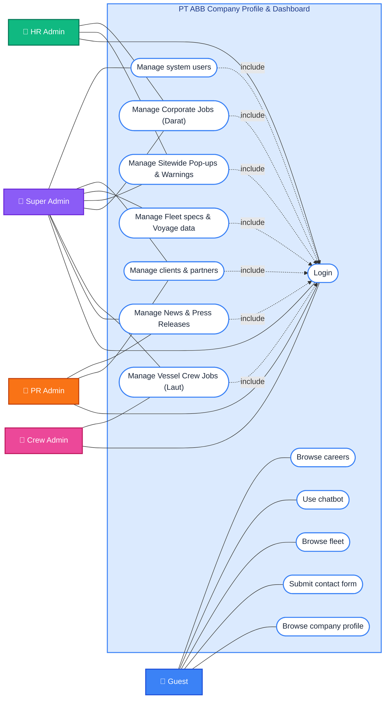
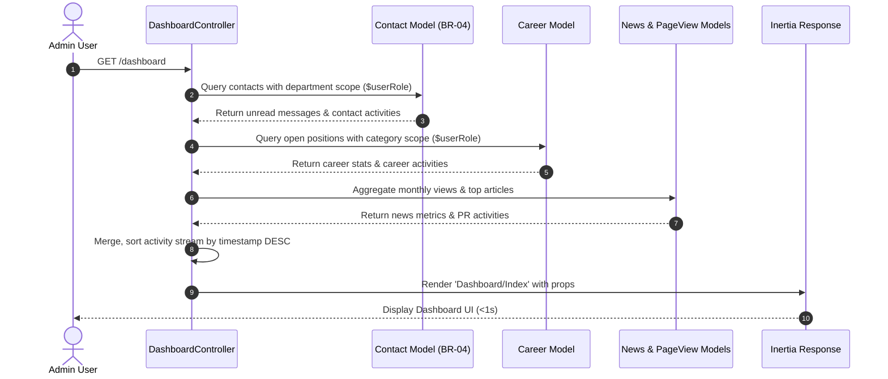

# Use Case Specification & Diagram: Admin Dashboard Controller

**Target File**: [app/Http/Controllers/DashboardController.php](file:///c:/laragon/www/ptabb/app/Http/Controllers/DashboardController.php)  
**Module**: PT ABB Company Profile & Admin Dashboard System  
**Framework Layer**: Laravel 13 Controller / Inertia.js v2 Bridge  
**Relevant Standards & Rules**: `BR-01` (RBAC), `BR-04` (Department Message Privacy Scoping), `NFR-P` (Inertia Response < 1s)

---

## 1. System Use Case Diagram

Below is the complete UML Use Case Diagram for the **PT ABB Company Profile & Dashboard** application:



---

## 2. Actor Matrix & Role Scoping (`BR-01`)

| Actor | Dashboard Access Scope | Primary Use Cases |
|---|---|---|
| **Guest** | Unauthenticated Public Visitors | Browse careers, Use chatbot, Browse fleet, Submit contact form, Browse company profile |
| **Super Admin** | Full visibility across all modules: Fleet, HQ Info, Users, Careers, PR News, Contact Messages, Banners, Branches, Telemetry | Manage system users, Manage clients & partners, Manage Fleet specs & Voyage data, Manage all jobs & news |
| **HR Admin** | Restricted to Corporate Careers (`corporate`), HRD & General Contact Messages (`hrd`, `general`), Pop-up Banners | Manage Corporate Jobs (Darat), Manage Sitewide Pop-ups & Warnings |
| **Crew Admin** | Restricted to Crew Careers (`crew`), Crew & General Contact Messages (`crew`, `general`) | Manage Vessel Crew Jobs (Laut) |
| **PR Admin** | Restricted to News, News Categories, Clients, Branch Network, Non-HR/Non-Crew Contact Messages | Manage News & Press Releases, Manage clients & partners |

---

## 3. Detailed Use Case Specifications

### Use Case UC-DB-01: Load Role-Tailored Admin Dashboard Index

* **Primary Actor**: Authenticated Admin (`Super Admin`, `HR Admin`, `Crew Admin`, `PR Admin`).
* **Precondition**: User has an active, authenticated web session.
* **Trigger**: User navigates to `/dashboard` or submits an Inertia page request.

#### Main Flow:
1. User requests `/dashboard`.
2. `DashboardController@index` retrieves the current authenticated user and detects `$userRole`.
3. Controller executes scoped sub-queries for total counts:
   - `fleetsCount`
   - `newsCount`
   - `clientsCount`
   - `careersCount`
   - `notificationsCount`
   - `unreadMessagesCount` & `olderUnreadCount` (>48 hours)
4. Controller computes monthly readership metrics for News articles (`newsViewsThisMonth` vs `newsViewsLastMonth`).
5. Controller builds chart time-series datasets (`week`, `month`, `year`).
6. Controller compiles the real-time dynamic activity feed (`recentActivities`).
7. Controller returns an Inertia response rendering `Dashboard/Index` with serialized JSON props.

---

### Use Case UC-DB-02: Role-Gated Contact Inquiry Filter (`BR-04`)

* **Goal**: Enforce privacy rule `BR-04` by hiding HRD-routed messages from Crew and PR admins at the query level.
* **Actor**: All Admin Roles.

#### Filter Rules Matrix:
```php
if ($userRole === 'hr_admin') {
    // Only HRD and General inquiries
    $contactsQuery->whereIn('department', ['hrd', 'general']);
} elseif ($userRole === 'crew_admin') {
    // Only Crew and General inquiries
    $contactsQuery->whereIn('department', ['crew', 'general']);
} elseif ($userRole === 'pr_admin') {
    // Exclude HRD and Crew inquiries
    $contactsQuery->where(function ($q) {
        $q->whereNull('department')->orWhereNotIn('department', ['hrd', 'crew']);
    });
}
// Super Admin bypasses restrictions to view all messages
```

---

### Use Case UC-DB-03: Scope-Restricted Career Metrics Calculation

* **Goal**: Restrict job opening statistics according to HR responsibility area.
* **Actor**: HR Admin, Crew Admin, Super Admin, PR Admin.

#### Execution Rules:
- **HR Admin**: Query filtered by `where('category', 'corporate')`.
- **Crew Admin**: Query filtered by `where('category', 'crew')`.
- **PR Admin**: Query short-circuited with `whereRaw('1 = 0')` (0 results visible).
- **Super Admin**: Query includes all corporate and crew postings.

---

### Use Case UC-DB-04: News Readership Metrics & Time-Series Aggregation

* **Goal**: Aggregate reader statistics for PR department performance tracking.
* **Actor**: PR Admin, Super Admin.

#### Processing Steps:
1. Calculates date boundaries for current month (`startOfMonth` to `endOfMonth`) and previous month (`startOfLastMonth` to `endOfLastMonth`).
2. Queries the `page_views` table for routes matching `news.show` or URL patterns `/news%`.
3. **Fallback Logic**: If `page_views` contains no records, dynamically approximates view trends from `News::sum('view_count')` to prevent empty UI displays.
4. Generates standard structured datasets (`week`, `month`, `year`) for frontend line/bar chart rendering.
5. Fetches top 10 published news articles sorted by `view_count DESC`.

---

### Use Case UC-DB-05: Real-Time Dynamic Activity Feed Aggregation

* **Goal**: Aggregate chronological updates across multiple domain entities into a unified stream (`recentActivities`).
* **Actor**: All Admin Roles.

#### Entity Sources & Scoping:
1. **Contacts**: Latest 10 messages matching `BR-04` role filters.
2. **News & Clients**: Latest 10 articles and client additions (Visible to `super_admin`, `pr_admin`).
3. **Careers**: Latest 10 job postings (Visible to `super_admin`, `hr_admin`, `crew_admin`).
4. **Fleets & Telemetry**: Latest 10 vessel updates and voyage waypoints (Visible to `super_admin`).
5. **Pop-up Banners**: Latest 10 site notifications (Visible to `super_admin`, `hr_admin`).
6. **User Accounts & HQ Info**: Latest 10 admin profile updates and HQ contact info changes (Visible to `super_admin`).
7. **Branch Offices & News Categories**: Latest 10 operational branch updates (Visible to `super_admin`, `pr_admin`).



---

## 4. Non-Functional Requirements (NFR Compliance)

- **Performance (`NFR-P`)**: Inertia client-side route transitions load within **< 1s** by executing indexed lightweight queries and limiting activity sub-selects (`take(10)`).
- **Security (`NFR-SEC`)**: Query parameters use Eloquent ORM parameterized queries to prevent SQL injection. `BR-04` role filters are enforced at DB query level to prevent client-side data leaks.
