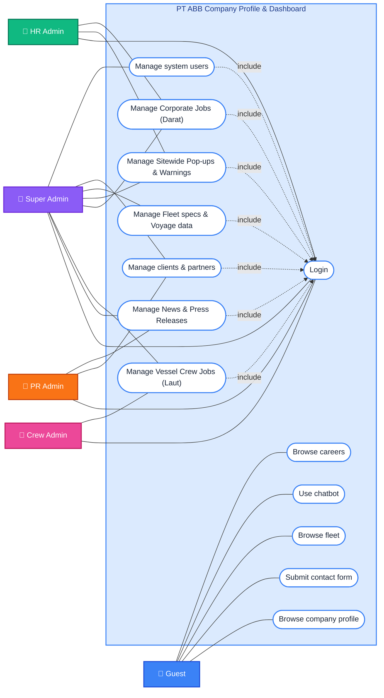

# PT ABB Company Profile & Dashboard — Use Case Diagram

This document contains the official UML Use Case Diagram for the PT. ABB Website v2.0 application and Dashboard system.

## Use Case Diagram

---

## Specification Summary Table

| Actor | Role / Scope | Primary Use Cases | Included Dependencies |
|---|---|---|---|
| **Guest** | Unauthenticated Public Visitor | Browse careers, Use chatbot, Browse fleet, Submit contact form, Browse company profile | None |
| **HR Admin** | Human Resources Admin | Manage Corporate Jobs (Darat), Manage Sitewide Pop-ups & Warnings | Include `Login` |
| **Crew Admin** | Maritime Crew Admin | Manage Vessel Crew Jobs (Laut) | Include `Login` |
| **PR Admin** | Public Relations Admin | Manage News & Press Releases, Manage clients & partners | Include `Login` |
| **Super Admin** | Full System Administrator | Manage system users, Manage Fleet specs & Voyage data, Manage clients & partners, Sitewide pop-ups, Corporate & Crew jobs, News | Include `Login` |

---

## Key Business Rules Mapping (`BR-01` to `BR-06`)

1. **`BR-01` (Role-Based Access Control)**: Enforced across all admin use cases (`Manage Users`, `Manage Corporate Jobs`, `Manage Vessel Crew Jobs`, `Manage News`, `Manage Fleet`).
2. **`BR-02` (IMO Uniqueness)**: Enforced inside `Manage Fleet specs & Voyage data`.
3. **`BR-03` (News Slug Generation)**: Enforced inside `Manage News & Press Releases`.
4. **`BR-04` (Department Message Scoping)**: HRD messages filtered from Crew & PR admins inside `Submit contact form` / Dashboard inbox review.
5. **`BR-05` (AI Chatbot Fallback)**: Enforced in `Use chatbot`.
6. **`BR-06` (Active Popup Limit)**: Max 1 active popup per type enforced in `Manage Sitewide Pop-ups & Warnings`.
